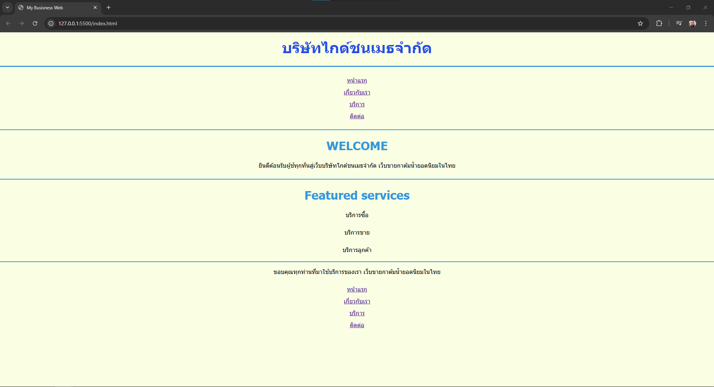
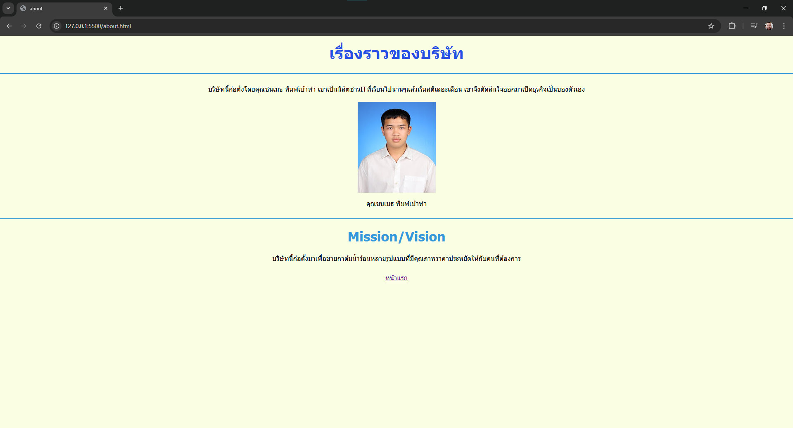
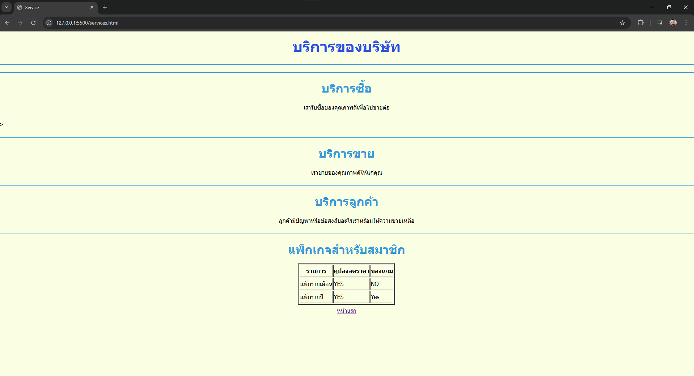
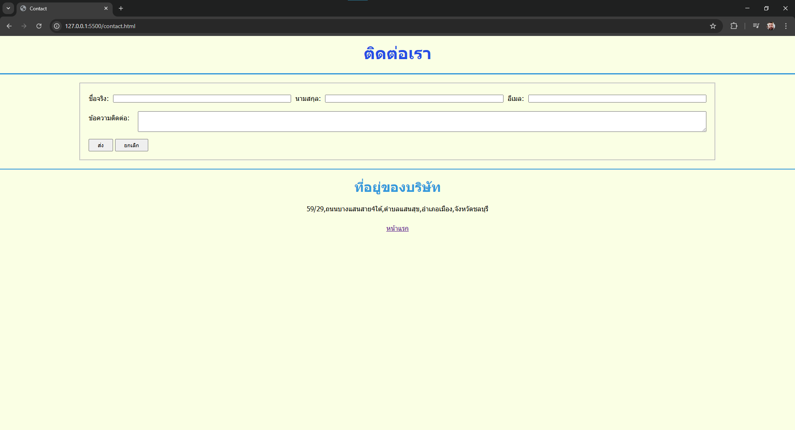

# Assignment 1:สร้างเว็บไซต์ธุรกิจที่สนใจ

##  File Structure

```
my-business-web
├── index.html
├── about.html 
├── services.html
├── contact.html
├── images/
│   ├── home.png
│   ├── about.png
│   ├── services.png
│   ├── contact.png
└── README.md 
```
## 🔗 Page Links

- [Home](index.html)
- [About](about.html)
- [Services](services.html)
- [Contact](contact.html)







